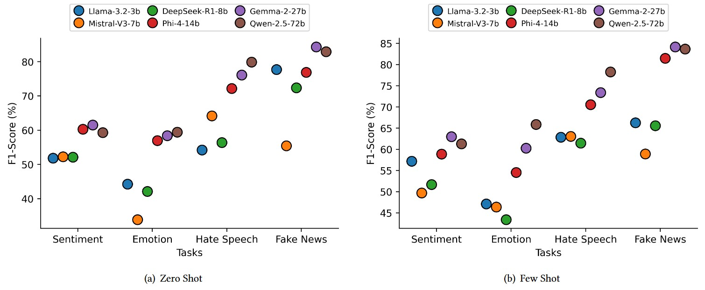

# (CAP 6640 Course Project)
# Evaluating Open-Source LLMs for Bengali Text Classification Across Multiple Domains


<p align="center">
    <a></a>  <br>
</p>
<p>
<em> LLMs performance with two prompt settings across various classification tasks including Sentiment Analysis, Emotion Recognition, Hate Speech Detection, and Fake News Detection.</em></p>


# Instructions

- To run the script you need to  install `Python=3.10.x`. For LLM inference, both [vLLM](https://docs.vllm.ai/en/stable/index.html) and Huggingface `Pipeline` has been used. 

- If you are using any IDE, then first clone (`git clone <url>`) the repository. Then create a virtual environment and activate it.

  ```
  conda create -n NLU Python=3.10.12 
  conda activate NLU
  ```    

- Install all the dependencies.<br>
  ```
  pip install -r requirements.txt
  ```
## Evaluated LLMs

We downloaded the instruct version of the models from the Huggingface Library.

- [Llama-3.2-3B](https://huggingface.co/meta-llama/Llama-3.2-3B-Instruct)
- [Mistral-V3-7B](https://huggingface.co/mistralai/Mistral-7B-Instruct-v0.3)
- [DeepSeek-R1-8B](https://huggingface.co/deepseek-ai/DeepSeek-R1-Distill-Llama-8B) (Llama Distilled)
- [Phi-4-14B](https://huggingface.co/microsoft/phi-4)
- [Gemma-2-27B](https://huggingface.co/google/gemma-2-27b)
- [Qwen-2.5-72B-AWQ](https://huggingface.co/Qwen/Qwen2.5-72B-Instruct-AWQ)

Prompts for each task are organized in the `Prompts` folder.


## LLM inference (Examples)

To get the **Llama** model response with **Zero-Shot** prompting for any task, run the following script. If you are not in the `Scripts` folder.

```
cd Scripts

python zero_few_shot.py \
--llm_id meta-llama/Llama-3.2-3B-Instruct \
--llm_name llama32-3B \
--dataset_name emo \            # emotion recognition
--prompt_type zero              # zero shot prompting
```

To get the **Qwen** model response with **Few-Shot** prompting for any task, run the following script. If you are not in the `Scripts` folder.

```
cd Scripts

python zero_few_shot.py \
--llm_id Qwen/Qwen2.5-72B-Instruct-AWQ \
--llm_name qwen-72B \
--dataset_name hate \        # hate speech detection
--prompt_type few           # few shot prompting
```


**Arguments**

- `--llm_id`: Specify the LLM want to use.
- `--llm_name`: Specify the llm name.
- `--dataset_name`: Specify dataset name (<u>option:</u> `senti`,`emo`,`hate`, or `fake`).
- `--prompt_type`: Specify the **prompting** technique you want to use. (`zero`,`few`)

You will get an excel file in **Results/** folder that store the responses for the corresponding LLM.

*The `plot-notebook.ipynb`* file contains the code for the result visualization.

---


